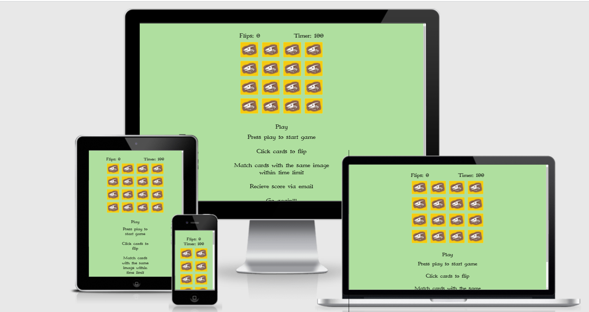

<h1 align="left">Dinosaur Seek</h1>

[View the live project here.](https://macannadev.github.io/Dinosaur-game.PP2/)

Dinosaur Seek is a card matching game designed for dinosaur enthusiasts
<h2 align="center"></h2>

## User Experience (UX)

-   ### User story

      1. I want to play a game and have fun

      2. I want to learn about dinosaurs

      3. I want to have a score so I can challenge friends

    
- ### Design

    -   #### Typography
        -   I have decieded to use the font type Immortal as it has an archaic aesthetic.
    -   #### Images
        -   The images  have chosen are for the dinosaurs contain text underneatth thme which allows the user to learn whilst playing  .
        -  The backside of the card images used contains bones which remind people of dinosaurs, in keeping with the theme.
        -   The front and back are desingned to ressemble playing cards

### Features
- Timer- The timer has tow purposes, the first is to limit the time the user has to finish the game which creates a challenge and the second is that it is used to generate the users score.
- Flip counter lets the user know how many flips it takes them to completet the game, this also contributes to the score.
- Play button- The game will not start until the play button is pressed.
- Game over- When the timer run out the game is over.
- Victory- When the user wins they are offered an input to send their to their email.

### Languages Used

-   [HTML5](https://en.wikipedia.org/wiki/HTML5)
-   [CSS3](https://en.wikipedia.org/wiki/Cascading_Style_Sheets)
-   [Javascript](https://en.wikipedia.org/wiki/JavaScript)_

### Frameworks, Libraries & Programs Used


1. [1001 FONTS:](https://www.1001fonts.com/)
    - 1001 FONTS were used to download Immortal font and upload it to the the fonts folder.
    

1. [Git:](https://git-scm.com/)
    - Git was used for version control by utilizing the Gitpod terminal to commit to Git and Push to GitHub.
1. [GitHub:](https://github.com/)
    - GitHub is used to store the projects code after being pushed from Git.
    

1. [Tinypng:](https://tinypng.com/)
    - Tinypng allowed me to compress the images, which allowed the website to load faster, increasing its performance rating.


## Testing
### Code Validation

The W3C Markup Validator and W3C CSS Validator Services were used to validate the project.

-   [HTML Validator](https://jigsaw.w3.org/css-validator/#validate_by_uri) - [Results](readme-images/HTMLvalidator-w3.png)
-   [W3C CSS Validator](https://jigsaw.w3.org/css-validator/#validate_by_uri) - [Results](readme-images/css-validator.png)

### Lighthouse testing

The website was tested for both mobile and desktop in three browsers
- [Chrome mobile results](readme-images/chrome-lighthouse-mobile.png)
- [Chrome desktop results](readme-images/chrome-lighthouse-desktop.png)

- [Edge mobile results](readme-images/edge-lighthouse-mobile.png)
- [Edge desktop results](readme-images/edge-lighthouse-desktop.png)

- [Mozilla mobile results](readme-images/mozilla-lighthouse-mobile.png)
- [Mozilla desktop results](readme-images/mozilla-lighthouse-desktop.png)

### Testing User Stories from User Experience (UX) Section

1.   I want to play a game and have fun.
    
     - The game functions as game we usually play should. 

     - The game is challenging, but not too challenging, the user can win and score high with effort.

2.  I want to learn about dinosaurs

    - Each front side contains and image of a different dinosaur.

    - Each front side has a name underneath the image which helps the user remememer their complicated names

3. I want to have a score so I can challenge friends
       
     - When the user wins they have the option to enter their email and recive the score they have achieved.They can send this to their frinds as proof of their victory!

     
     
### Further Testing

 1. Email JS

      -  Filled in email field and sent to user.

      -  Checked accuracy of score


## Deployment

To deploy a website on GitHub Pages, follow these steps:

   1. Go to the repository page

   2. Click on settings icon in the top of the page
   
   3. Find "GitHub Pages" section

   4. Click on the "Source" dropdown menu

   5. Select "master branch" option

   6. A green success message should appear in the "GitHub Pages" section with the link to the live preview of the project.

### GitHub Pages

The project was deployed to GitHub Pages using the following steps...

 1. Log in to GitHub and locate the [GitHub Repository](https://github.com/)
 2. At the top of the Repository (not top of page), locate the "Settings" Button on the menu.
    - Alternatively Click [Here](https://raw.githubusercontent.com/) for a GIF demonstrating the process starting from Step 2.
 3. Scroll down the Settings page until you locate the "GitHub Pages" Section.
 4. Under "Source", click the dropdown called "None" and select "Master Branch".
 5. The page will automatically refresh.
 6. Scroll back down through the page to locate the now published site [link](https://github.com) in the "GitHub Pages" section.

### Forking the GitHub Repository

By forking the GitHub Repository we make a copy of the original repository on our GitHub account to view and/or make changes without affecting the original repository by using the following steps...

1. Log in to GitHub and locate the [GitHub Repository](https://github.com/)
2. At the top of the Repository (not top of page) just above the "Settings" Button on the menu, locate the "Fork" Button.
3. You should now have a copy of the original repository in your GitHub account.

### Making a Local Clone

1. Log in to GitHub and locate the [GitHub Repository](https://github.com/)
2. Under the repository name, click "Clone or download".
3. To clone the repository using HTTPS, under "Clone with HTTPS", copy the link.
4. Open Git Bash
5. Change the current working directory to the location where you want the cloned directory to be made.
6. Type `git clone`, and then paste the URL you copied in Step 3.

```
$ git clone https://github.com/YOUR-USERNAME/YOUR-REPOSITORY
```

7. Press Enter. Your local clone will be created.

```
$ git clone https://github.com/YOUR-USERNAME/YOUR-REPOSITORY
> Cloning into `CI-Clone`...
> remote: Counting objects: 10, done.
> remote: Compressing objects: 100% (8/8), done.
> remove: Total 10 (delta 1), reused 10 (delta 1)
> Unpacking objects: 100% (10/10), done.
```

Click [Here](https://help.github.com/en/github/creating-cloning-and-archiving-repositories/cloning-a-repository#cloning-a-repository-to-github-desktop) to retrieve pictures for some of the buttons and more detailed explanations of the above process.

## Credits

### images

 - [Dinosaurs for cards](https://www.freepik.com/free-vector/dinosaurs-colored-isolated-icons-set_4186205.htm#query=cartoon%20dinosaur&position=3&from_view=keyword)

 - [Fossil for cards](https://pngtree.com/freepng/cartoon-dinosaur-bone-fossil-clipart_5988910.html)

 - [Dinosaurs in nature](https://www.freepik.com/free-vector/dinosaurs-cartoon-character-nature-scene_12364753.htm#query=cartoon%20dinosaur&position=2&from_view=keyword)

 
 - All of the above images have been altered by me to some degree and are not representitive of the originators work or intentions.

 - These images are not being used for commercial purposes
 

### Code

- [Memory game tutorial 1](https://www.youtube.com/watch?v=ZniVgo8U7ek&ab_channel=freeCodeCamp.org)

- [Memory game tutorial 2](https://www.youtube.com/watch?v=3uuQ3g92oPQ)

- [Memory game tutorial 3](https://www.youtube.com/watch?v=-tlb4tv4mC4&ab_channel=DevEd)

- [Email input](https://www.w3schools.com/tags/att_input_type_email.asp)

- [Markdown](https://github.com/adam-p/markdown-here/wiki/Markdown-Cheatsheet#links)

-  All text content was written by the developer.

### Acknowledgements

-   My Mentor for Antonio Rodriguez for helpful advice on what to do and what not to do.